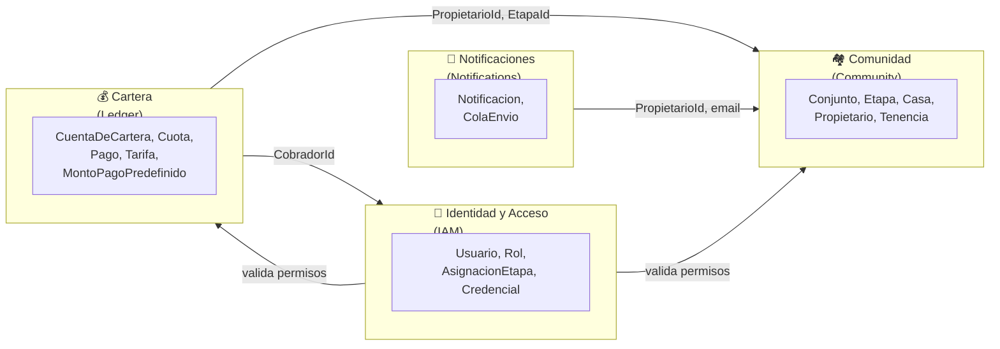
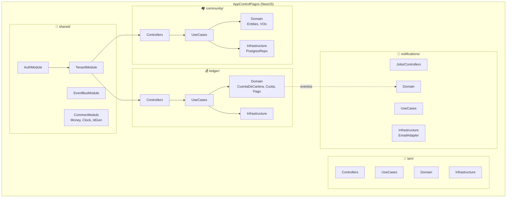
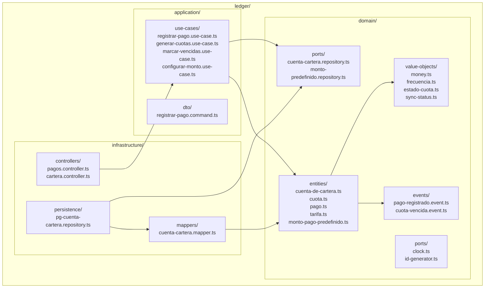

# 05 — Arquitectura Hexagonal + DDD

> **Propósito:** Visión general de la arquitectura del sistema. Si solo lees un documento técnico, que sea este.

---

## Principios Arquitectónicos

1. **Hexagonal (Ports & Adapters):** el dominio es puro, sin dependencias externas. Frameworks, bases de datos, y servicios externos son adaptadores intercambiables.
2. **DDD con Bounded Contexts:** dividimos el dominio en 4 contextos delimitados, cada uno con su propio lenguaje y modelo.
3. **Offline-first:** la app móvil es la fuente de verdad inmediata; el backend es el sistema de record consolidado.
4. **Event-Driven:** los Bounded Contexts se comunican mediante eventos de dominio (desacoplamiento).
5. **Multi-tenant por diseño:** todas las entidades llevan `tenantId` desde el día 1.

---

## Diagrama C4 — Contexto del Sistema

```mermaid
flowchart TB
    subgraph Personas
        AdminP[👤 Administrador<br/>del Conjunto]
        CobradorP[👤 Cobrador]
        PropP[👤 Propietario]
    end

    subgraph Sistema["🏠 AppControlPagos<br/>(Sistema principal)"]
        direction TB
        BACKEND[Backend NestJS<br/>API + Jobs]
        MOBILE[App Móvil Flutter<br/>offline-first]
    end

    subgraph Externos["Sistemas Externos"]
        EMAIL[📧 Proveedor de Correo<br/>Resend / SendGrid]
        SUPABASE[(☁️ Supabase<br/>PostgreSQL + Auth)]
    end

    AdminP -->|configura conjunto,<br/>tarifas, usuarios| MOBILE
    AdminP -->|configura conjunto,<br/>tarifas, usuarios| BACKEND
    CobradorP -->|registra pagos<br/>(online/offline)| MOBILE
    PropP -->|consulta su cartera| MOBILE

    MOBILE -->|HTTPS REST| BACKEND
    MOBILE -->|SQLite local| MOBILE
    BACKEND -->|persiste datos| SUPABASE
    BACKEND -->|envía notificaciones| EMAIL
    BACKEND -.->|futuro multi-tenant| SUPABASE
```

---

## Bounded Contexts



| BC | Responsabilidad | Agregado Raíz |
|---|---|---|
| **Community** | Catálogo de conjunto, etapas, casas, propietarios | `Conjunto`, `Propietario` |
| **IAM** | Autenticación, autorización, roles | `Usuario` |
| **Ledger** | Cuotas, pagos, tarifas, montos predefinidos | `CuentaDeCartera` |
| **Notifications** | Cola de envío de correos, reintentos | `Notificacion` |

---

## Mapa de Módulos NestJS



---

## Estructura de Carpetas (monorepo)

```
app-control-pagos/
├── apps/
│   ├── backend/                          # NestJS
│   │   ├── src/
│   │   │   ├── main.ts
│   │   │   ├── app.module.ts
│   │   │   ├── shared/
│   │   │   │   ├── auth/
│   │   │   │   ├── tenant/
│   │   │   │   ├── event-bus/
│   │   │   │   └── common/               # Money, Clock, IdGenerator
│   │   │   ├── community/
│   │   │   │   ├── application/          # UseCases, DTOs, Commands
│   │   │   │   ├── domain/               # Entities, VOs, Repos interfaces, Events
│   │   │   │   └── infrastructure/       # Postgres repos, controllers
│   │   │   ├── iam/
│   │   │   ├── ledger/
│   │   │   └── notifications/
│   │   ├── test/
│   │   └── nest-cli.json
│   │
│   └── mobile/                            # Flutter
│       ├── lib/
│       │   ├── main.dart
│       │   ├── core/
│       │   │   ├── network/              # ApiClient (Dio)
│       │   │   ├── database/             # SQLite local (sqflite/drift)
│       │   │   ├── sync/                 # SyncService, ConnectivityDetector
│       │   │   └── di/                   # GetIt / Injectable
│       │   ├── features/
│       │   │   ├── auth/
│       │   │   ├── cobro/                # RegistrarPago BLoC + UI
│       │   │   ├── cartera/              # VisualizarCartera BLoC + UI
│       │   │   ├── propietarios/
│       │   │   └── config/
│       │   └── shared/
│       └── test/
│
├── packages/
│   └── contracts/                         # DTOs TypeScript compartidos (openapi-ts)
│
├── infra/
│   ├── supabase/
│   │   ├── migrations/
│   │   └── seed.sql
│   └── docker-compose.yml
│
├── docs/                                  # ← ESTÁS AQUÍ
│   ├── README.md
│   ├── 01-vision.md ... 12-trazabilidad.md
│   ├── glosario.md
│   └── diagramas/
│
├── package.json
└── README.md
```

---

## Diagrama de Paquetes — Ledger (backend)


