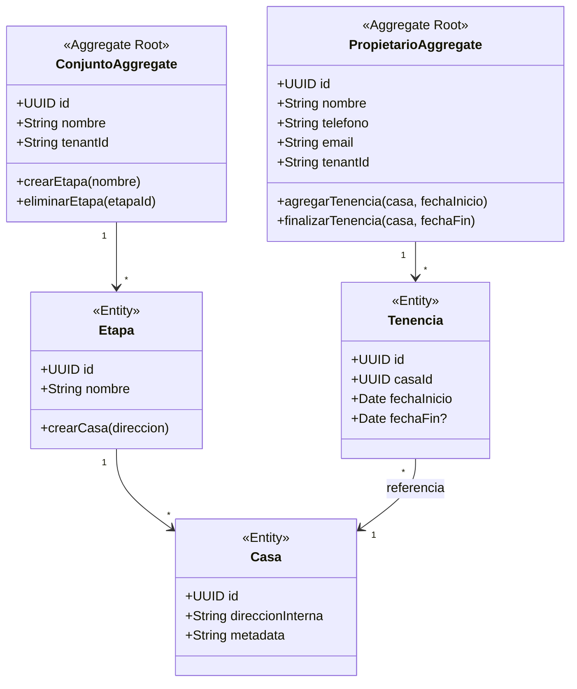
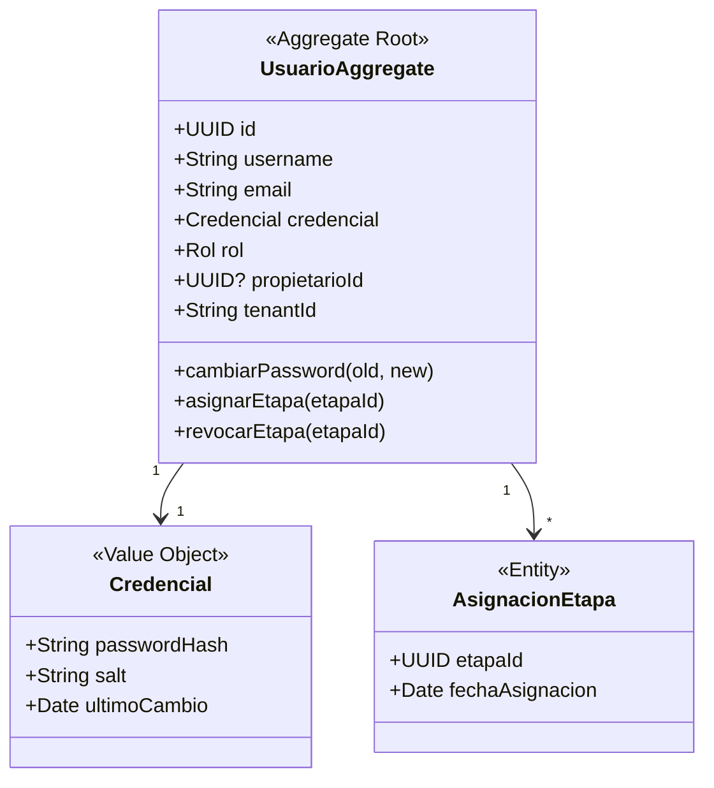
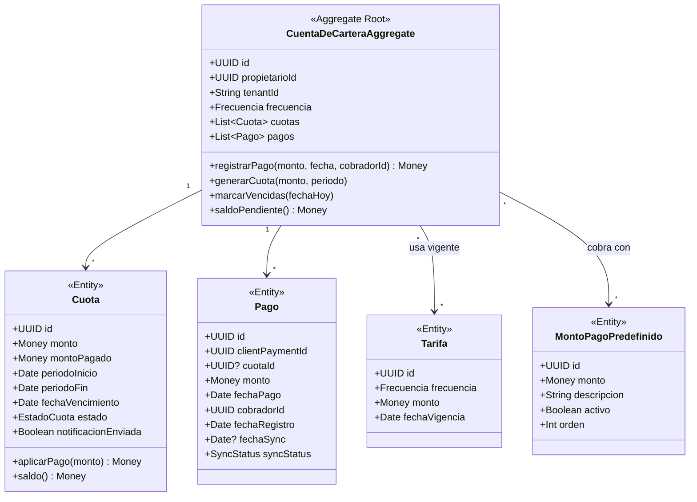
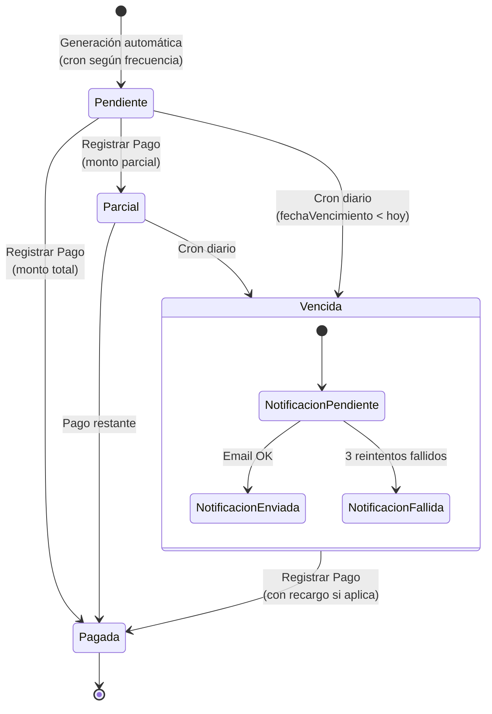
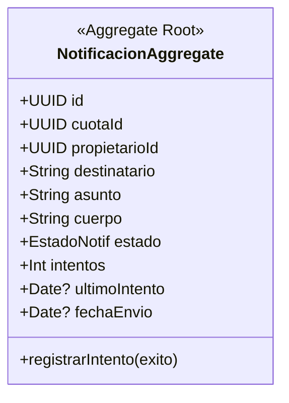

# 06 — Modelo de Dominio

> **Propósito:** Descripción detallada de los agregados, entidades, value objects e invariantes de cada Bounded Context.

---

## 6.1 BC Comunidad (Community)

### Agregado: Conjunto



**Invariantes:**
- Una `Casa` pertenece a una sola `Etapa`.
- Una `Tenencia` activa (sin `fechaFin`) no puede duplicarse para la misma `Casa`.
- `Propietario` es independiente del `Conjunto` (para soportar multi-tenant futuro).

---

## 6.2 BC IAM (Identidad y Acceso)

### Agregado: Usuario



**Invariantes:**
- `username` y `email` únicos dentro del tenant.
- Un `Usuario` con rol `Propietario` debe estar vinculado a un `Propietario`.
- Solo usuarios con rol `Cobrador` pueden tener `AsignacionEtapa`.

**Roles disponibles:**

| Rol | Permisos |
|---|---|
| `ADMIN` | CRUD completo sobre Conjunto, Etapas, Casas, Tarifas, Usuarios, Montos. Reportes. |
| `COBRADOR` | CRUD Propietarios (en etapas asignadas), Registrar pagos, Ver cartera (etapas asignadas). |
| `PROPIETARIO` | Ver solo su propia cartera (lectura). |

---

## 6.3 BC Cartera (Ledger) — EL MÁS CRÍTICO

### Agregado: CuentaDeCartera



### Invariantes CRÍTICAS (garantizadas por la raíz del agregado)

| # | Invariante | ¿Qué pasa si se viola? |
|---|---|---|
| 1 | `saldoPendiente() = Σ cuotas.saldo()` — nunca negativo | Saldos inconsistentes |
| 2 | Un `Pago` no puede aplicarse a una `Cuota` ya `PAGADA` | Doble pago |
| 3 | `clientPaymentId` es único (idempotencia para sync) | Duplicación de pagos |
| 4 | Máximo **5** `MontoPagoPredefinido` activos por tenant | Control financiero |
| 5 | Una `Cuota` pasa a `VENCIDA` solo por el job, nunca por el cobrador | Consistencia del proceso |
| 6 | Al aplicar un pago, se distribuye FIFO a la cuota más antigua con saldo | Orden lógico de cartera |

### Value Objects del BC Cartera

```typescript
// money.vo.ts
export class Money {
  constructor(
    public readonly amount: number,    // en centavos (integer)
    public readonly currency: 'COP'
  ) {}

  static ofCOP(pesos: number): Money {
    if (pesos < 0) throw new DomainError('Money no puede ser negativo');
    if (!Number.isInteger(pesos)) throw new DomainError('COP no acepta decimales');
    return new Money(pesos, 'COP');
  }

  add(other: Money): Money { /* ... */ }
  subtract(other: Money): Money { /* ... */ }
  isZero(): boolean { return this.amount === 0; }
  isGreaterThan(other: Money): boolean { return this.amount > other.amount; }
}

// frecuencia.vo.ts
export type Frecuencia = 'SEMANAL' | 'QUINCENAL' | 'MENSUAL';

export class Periodo {
  static calcularSiguiente(frecuencia: Frecuencia, desde: Date): Periodo {
    // Calcula inicio, fin y vencimiento según la frecuencia
  }
}

// estado-cuota.vo.ts
export type EstadoCuota = 'PENDIENTE' | 'PARCIAL' | 'PAGADA' | 'VENCIDA';

// estado-notificacion.vo.ts
export type EstadoNotif = 'PENDIENTE' | 'ENVIADA' | 'FALLIDA';

// sync-status.vo.ts
export type SyncStatus = 'PENDIENTE_SYNC' | 'SYNC_OK' | 'CONFLICTO';
```

### Diagrama de Estados de una Cuota



---

## 6.4 BC Notificaciones (Notifications)

### Agregado: Notificacion



**Invariantes:**
- Una notificación se crea **solo** cuando una cuota pasa a `VENCIDA` (evento de dominio).
- Máximo 3 reintentos antes de marcar `FALLIDA`.
- Backoff: inmediato → 15 min → 30 min.
