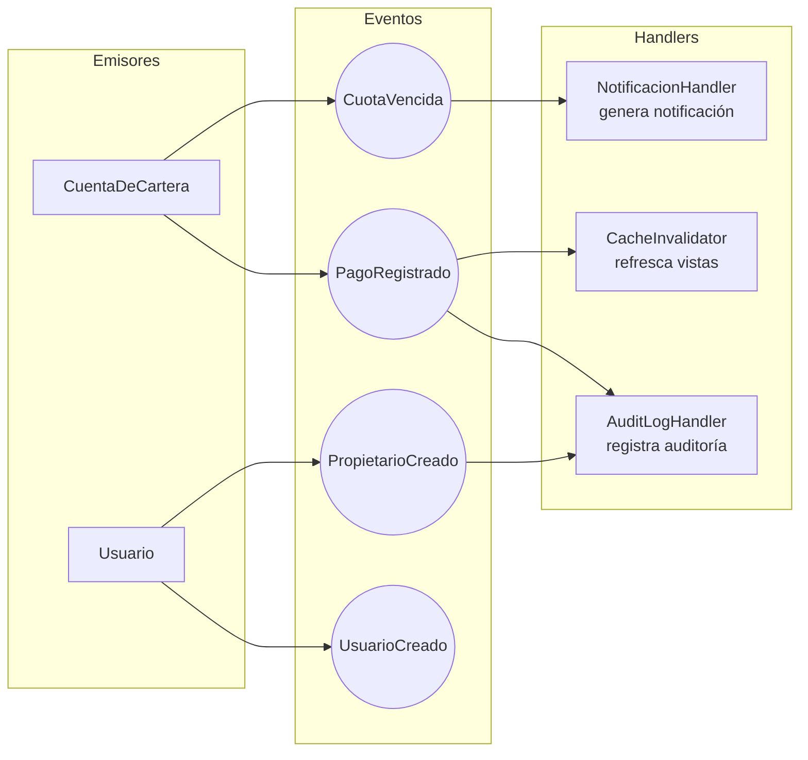

# 08 — Eventos de Dominio

> **Propósito:** Desacoplar los Bounded Contexts mediante eventos. Cuando algo importante ocurre en un agregado, se emite un evento que otros BCs pueden escuchar sin acoplarse.

---

## Mapa de Eventos



---

## Interfaz Base

```typescript
export interface DomainEvent {
  eventId: string;
  occurredOn: Date;
  eventType: string;
  tenantId: string;
  aggregateId: string;
  payload: unknown;
}
```

---

## Eventos

### PagoRegistradoEvent

Se emite cuando un pago es registrado exitosamente (local o sincronizado).

```typescript
export class PagoRegistradoEvent implements DomainEvent {
  eventType = 'PagoRegistrado';
  constructor(
    public eventId: string,
    public occurredOn: Date,
    public tenantId: string,
    public aggregateId: string,
    public payload: {
      pagoId: string;
      clientPaymentId: string;
      propietarioId: string;
      monto: number;
      cuotaId: string;
      cobradorId: string;
      syncStatus: SyncStatus;
    }
  ) {}
}
```

**Handlers:**
- `CacheInvalidator`: refresca vistas de cartera.
- `AuditLogHandler`: registra en la bitácora de auditoría.

### CuotaVencidaEvent

Se emite cuando el job nocturno marca una cuota como vencida.

```typescript
export class CuotaVencidaEvent implements DomainEvent {
  eventType = 'CuotaVencida';
  constructor(
    public eventId: string,
    public occurredOn: Date,
    public tenantId: string,
    public aggregateId: string,
    public payload: {
      cuotaId: string;
      propietarioId: string;
      monto: number;
      periodo: string;
    }
  ) {}
}
```

**Handlers:**
- `NotificacionHandler`: genera una `Notificacion` en estado `PENDIENTE` para envío por correo (CU-04).

```typescript
// handlers/notificacion.handler.ts
export class CuotaVencidaNotificationHandler {
  constructor(
    private readonly notifRepo: NotificacionRepository,
    private readonly propietarioRepo: PropietarioRepository,
    private readonly idGen: IdGenerator,
    private readonly clock: Clock
  ) {}

  async handle(event: CuotaVencidaEvent): Promise<void> {
    const propietario = await this.propietarioRepo.findById(event.payload.propietarioId);
    if (!propietario?.email) return; // no notificar si no hay email

    const notif = Notificacion.crearVencimiento(
      this.idGen.uuid(),
      event.payload.cuotaId,
      propietario.id,
      propietario.email,
      event.payload.monto,
      event.payload.periodo,
      this.clock.now()
    );
    await this.notifRepo.save(notif);
  }
}
```

### PropietarioCreadoEvent

Se emite cuando se registra un nuevo propietario (incluyendo el registro inline durante cobro).

```typescript
export class PropietarioCreadoEvent implements DomainEvent {
  eventType = 'PropietarioCreado';
  constructor(
    public eventId: string,
    public occurredOn: Date,
    public tenantId: string,
    public aggregateId: string,
    public payload: {
      propietarioId: string;
      nombre: string;
      casaId: string;
    }
  ) {}
}
```

**Handlers:**
- `AuditLogHandler`: registra la creación.

### UsuarioCreadoEvent

Se emite cuando se crea un nuevo usuario en el sistema.

```typescript
export class UsuarioCreadoEvent implements DomainEvent {
  eventType = 'UsuarioCreado';
  constructor(
    public eventId: string,
    public occurredOn: Date,
    public tenantId: string,
    public aggregateId: string,
    public payload: {
      usuarioId: string;
      username: string;
      rol: Rol;
      propietarioId?: string;
    }
  ) {}
}
```

**Handlers:**
- `AuditLogHandler`: registra la creación.

---

## Estrategia de Eventos

| Aspecto | Decisión |
|---|---|
| **Bus** | En fase MVP, bus **síncrono en proceso** (event emitter de NestJS). Fase 2 migrar a Redis Streams / RabbitMQ. |
| **Entrega** | Garantía **at-least-once**: el handler puede fallar y reintentar, pero el evento se emite una vez por transacción. |
| **Orden** | No se garantiza orden global entre eventos de distintos agregados. |
| **Idempotencia** | Cada handler debe ser idempotente (ej. `NotificacionHandler` chequea si ya existe notif para esa cuotaId). |
| **Evolución** | Los eventos se versionan por `eventType` (ej. `CuotaVencidaV2`). No se modifican eventos publicados. |
