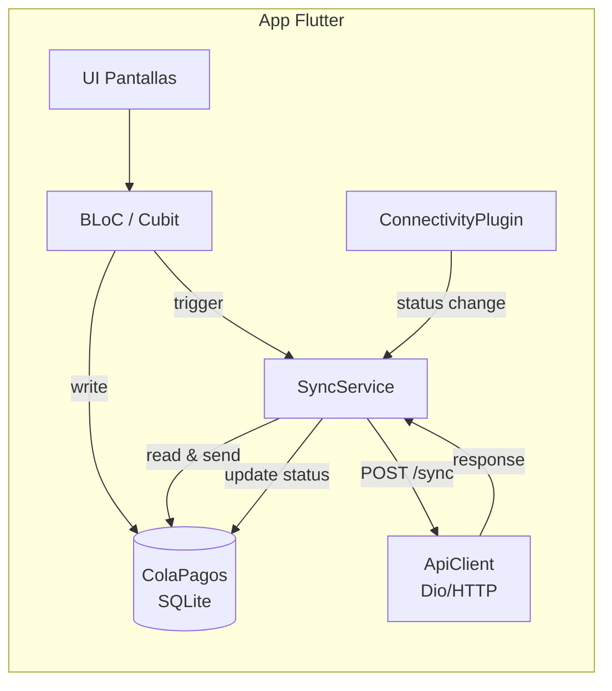
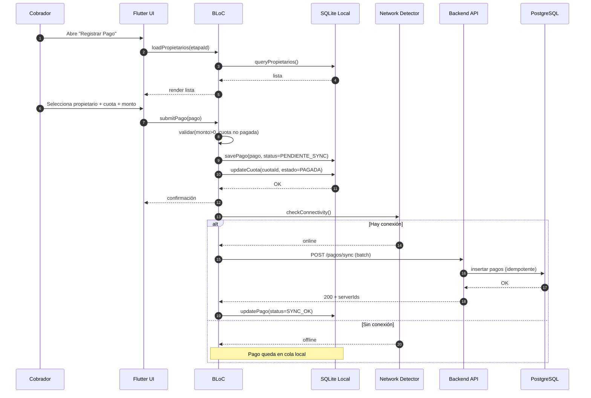
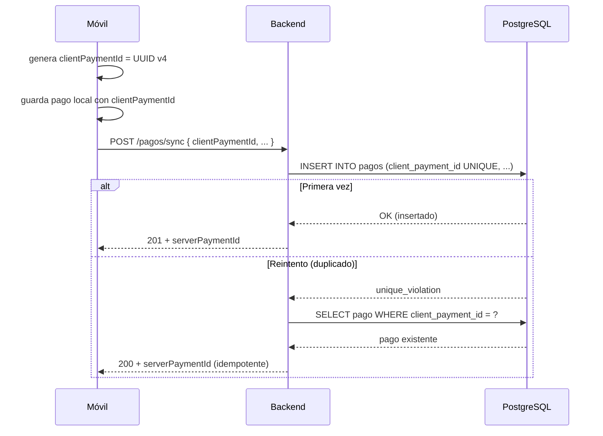

# 09 — Estrategias Técnicas

> **Propósito:** Documentar las estrategias clave de implementación: sincronización offline, idempotencia, multi-tenant y manejo de montos predefinidos.

---

## 9.1 Sincronización Offline-First

### Arquitectura



### Flujo de sincronización



### Reglas de la cola local

| Aspecto | Regla |
|---|---|
| **Almacenamiento** | SQLite (drift/sqflite) en el dispositivo móvil |
| **Estado inicial** | `PENDIENTE_SYNC` |
| **Orden de envío** | FIFO por `fechaRegistro` |
| **Reintento** | 3 intentos con backoff exponencial (5s, 30s, 120s) |
| **Conflicto** | Si el backend responde `CONFLICTO` → estado `CONFLICTO` local, notificar Admin |
| **Limpieza** | Pagos `SYNC_OK` se mantienen 30 días (para depuración) luego se purgan |

---

## 9.2 Idempotencia (Sync Offline)

### Problema

Un cobrador registra un pago offline. Al recuperar conexión, el móvil envía el pago al backend. Si la conexión se cae justo después de enviar pero antes de recibir la respuesta, el móvil reintenta. El backend debe garantizar que **no se duplique**.

### Solución



### Reglas de idempotencia

1. **`clientPaymentId`** es un UUID v4 generado en el móvil al crear el pago.
2. **Unique constraint** en la tabla `pagos (tenant_id, client_payment_id)`.
3. El móvil **nunca** borra el `clientPaymentId` local hasta recibir confirmación.
4. Si el backend recibe un `clientPaymentId` duplicado con el **mismo** payload → responde 200 (idempotente).
5. Si el backend recibe un `clientPaymentId` duplicado con payload **distinto** → responde `CONFLICTO` (error de consistencia).
6. Todos los comandos de escritura en el backend llevan `clientPaymentId` o `Idempotency-Key` header.

### Tabla de decisión

| ¿Existe clientPaymentId? | ¿Payload coincide? | Respuesta |
|---|---|---|
| No | — | 201 Created |
| Sí | Sí | 200 OK (idempotente) |
| Sí | No | 409 Conflict |

---

## 9.3 Multi-Tenant

### Estrategia elegida

**Shared database, shared schema, con columna `tenantId`** + **Row-Level Security (RLS)** en Supabase.

```mermaid
flowchart TB
    REQ[Request HTTP] --> AUTH[Auth Middleware]
    AUTH -->|extrae tenantId del JWT| CTX[TenantContext]
    CTX --> USECASE[Use Case]
    USECASE --> REPO[Repository]
    REPO -->|SELECT * FROM cuotas WHERE tenant_id = $1| DB[(PostgreSQL)]

    subgraph RLS["Row-Level Security (Supabase)"]
        DB -->|política: tenant_id = current_setting('app.tenant_id')| DB
    end

    USECASE -->|SET app.tenant_id = ?| DB
```

### Reglas

| Aspecto | Regla |
|---|---|
| **Columna** | `tenant_id UUID NOT NULL` en TODAS las tablas |
| **Índices** | Compuesto `(tenant_id, ...)` en todas las queries |
| **RLS** | Activado en todas las tablas; política `tenant_id = current_setting('app.tenant_id')` |
| **JWT** | `tenantId` va en el token JWT; el middleware lo extrae y setea al inicio del request |
| **Dominio** | El dominio recibe `tenantId` explícito en cada comando (no usa variables globales) |
| **Migración futura** | A "database-per-tenant" es transparente si se respeta el puerto `Repository` |

---

## 9.4 Montos Predefinidos (vs. Monto Libre)

### Regla de negocio

El Admin configura hasta **5 montos activos** por conjunto. El cobrador **no puede** ingresar un monto libre — solo selecciona de la lista.

### Implementación

```typescript
export class MontoPagoPredefinido {
  constructor(
    public readonly id: string,
    public readonly conjuntoId: string,
    public readonly monto: Money,
    public readonly descripcion: string,
    public readonly activo: boolean,
    public readonly orden: number
  ) {}

  // Invariante: máximo 5 activos por tenant
  static puedeAgregar(activosActuales: number): boolean {
    return activosActuales < 5;
  }
}
```

### Distribución FIFO de pagos parciales

Cuando un cobrador registra un pago con un monto predefinido:

1. El sistema identifica la **cuota más antigua** con saldo pendiente (>0).
2. Aplica el monto pagado a esa cuota.
3. Si sobra saldo del pago → pasa a la siguiente cuota más antigua.
4. Repite hasta agotar el monto pagado o saldar todas las cuotas.

```
Ejemplo:
Cuota 1 (semana 1): $10.000 - PENDIENTE
Cuota 2 (semana 2): $10.000 - PENDIENTE
Cuota 3 (semana 3): $10.000 - PENDIENTE

Pago registrado: $25.000 (monto predefinido)

1. Cuota 1 ← $10.000 → PAGADA
2. Cuota 2 ← $10.000 → PAGADA
3. Cuota 3 ← $5.000  → PARCIAL (saldo $5.000)
4. Cambio: $0 (pago totalmente distribuido)
```

---

## 9.5 Arquitectura de la App Móvil (Flutter)

### Componentes de sincronización


### Stack Flutter

| Capa | Librería |
|---|---|
| **Estado** | `flutter_bloc` (BLoC pattern) |
| **HTTP** | `dio` (con interceptors para auth + idempotency key) |
| **SQLite** | `drift` (type-safe, migraciones) |
| **Conectividad** | `connectivity_plus` (detección de red) |
| **DI** | `get_it` + `injectable` |
| **Ruteo** | `go_router` |
