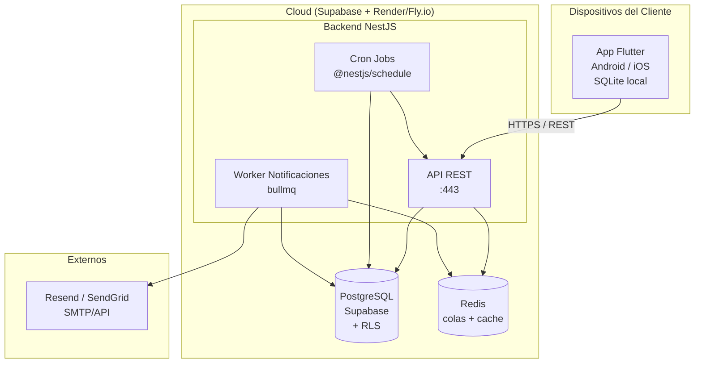

# 10 — Despliegue e Infraestructura

> **Propósito:** Diagrama de despliegue, servicios externos, costos estimados y plan de CI/CD.

---

## Diagrama de Despliegue



---

## Stack de Infraestructura

| Servicio | Proveedor | Plan MVP | Costo mensual |
|---|---|---|---|
| **Backend** | Fly.io / Railway | Nano (512MB RAM, 1 vCPU) | ~$5-10 USD |
| **Base de datos** | Supabase | Free tier (500MB, 5GB bandwidth) | $0 |
| **Redis** | Upstash | Free tier (10MB, 1000 commands/day) | $0 |
| **Correo** | Resend | Free tier (3000 emails/month) | $0 |
| **Storage** | Supabase Storage | Free tier (1GB) | $0 |
| **Autenticación** | Supabase Auth | Free tier (50000 users) | $0 |
| **CD / CI** | GitHub Actions | Free tier (2000 min/month) | $0 |
| **Monitoréo** | Sentry (free tier) | 5000 events/month | $0 |
| **Total estimado** | | | **~$5-10 USD/mes** |

---

## Notas de despliegue

### Backend (NestJS)

- **Runtime:** Node 20 LTS (contenedor Docker).
- **Escalado:** Horizontal detrás de load balancer (Fly.io Anycast IP).
- **Jobs:** `@nestjs/schedule` para generar cuotas y marcar vencidas (cron diario 00:05).
- **Worker de notificaciones:** bullmq con Redis para cola de correos con reintentos.

### Base de datos

- **MVP:** Supabase free tier (PostgreSQL 14, 500MB).
- **Migración futura:** Neon Serverless Postgres o RDS Aurora sin tocar el dominio (solo cambiar adaptador).
- **Backups:** Supabase hace backups diarios automáticos.
- **Migraciones:** TypeORM migrations (o Prisma, decisión pendiente).

### Redis

- **MVP:** Upstash Redis (serverless, free tier).
- **Uso:** Cola de notificaciones (`bullmq`), caché de vistas de cartera.
- **Migración futura:** Redis Cloud o ElastiCache.

### Email

- **MVP:** Resend (free tier, 3000 emails/mes).
- **Alternativa:** SendGrid (free tier, 100 emails/día).
- **Templates:** HTML plano con diseño responsive. En fase 2: MJML + templates dinámicos.

### App Móvil (Flutter)

- **Compilación:** `flutter build apk --split-per-abi` (Android), `flutter build ios` (iOS).
- **Distribución inicial:** APK directo (sideload) para cobradores. Play Store en fase 2.
- **Actualizaciones:** En fase 1, actualización manual (descargar nuevo APK). En fase 2, CodePush o deploy automático.

---

## CI/CD (GitHub Actions)

```yaml
# .github/workflows/deploy.yml (plan)
name: Deploy

on:
  push:
    branches: [main]

jobs:
  test-backend:
    runs-on: ubuntu-latest
    services:
      postgres:
        image: postgres:15
        env:
          POSTGRES_DB: test
          POSTGRES_PASSWORD: test
        ports: [5432:5432]
    steps:
      - uses: actions/checkout@v4
      - uses: actions/setup-node@v4
        with: { node-version: '20' }
      - run: npm ci
      - run: npm run test:unit
      - run: npm run test:integration

  deploy-backend:
    needs: [test-backend]
    runs-on: ubuntu-latest
    steps:
      - uses: actions/checkout@v4
      - uses: superfly/flyctl-actions/setup-flyctl@master
      - run: flyctl deploy --remote-only
        env:
          FLY_API_TOKEN: ${{ secrets.FLY_API_TOKEN }}

  build-mobile:
    runs-on: ubuntu-latest
    steps:
      - uses: actions/checkout@v4
      - uses: subosito/flutter-action@v2
        with: { flutter-version: '3.x' }
      - run: flutter build apk --split-per-abi
      - uses: actions/upload-artifact@v4
        with:
          name: app-release
          path: build/app/outputs/flutter-apk/*.apk
```

---

## Seguridad

| Aspecto | Medida |
|---|---|
| **Autenticación** | JWT con Supabase Auth (refresco automático) |
| **Autorización** | RLS en PostgreSQL + validación por rol en middleware |
| **HTTPS** | Obligatorio en todas las comunicaciones |
| **Secretos** | Variables de entorno en Fly.io, nunca en el código |
| **Sanitización** | Input validation en todos los endpoints (class-validator) |
| **SQL Injection** | ORM (TypeORM/Prisma) + parámetros con nombre |
| **CORS** | Solo orígenes conocidos (dominio del Admin, app móvil) |
| **Rate limiting** | `@nestjs/throttler` (100 req/min por IP) |

---

## Monitoreo

| Herramienta | Qué monitorea |
|---|---|
| **Sentry** | Errores no controlados en backend y frontend |
| **Uptime Robot** | Health check del backend cada 5 minutos |
| **Logs** | Fly.io logs (stdout/stderr) + estructura JSON |
| **Métricas** | (Futuro) Prometheus + Grafana para DB y Redis |
