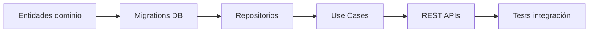
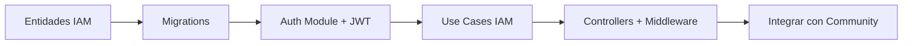
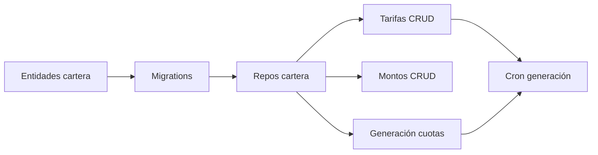
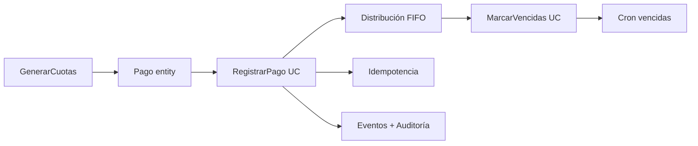
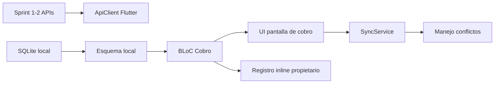
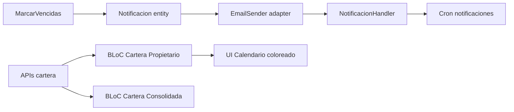
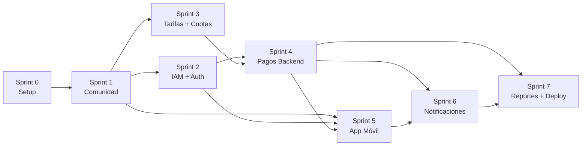

# 13 — Plan de Desarrollo (Sprint Roadmap)

> **Propósito:** Plan de implementación profesional con sprints de 2 semanas, tareas granularizadas, dependencias y criterios de Done. Para que el equipo sepa QUÉ hacer, EN QUÉ ORDEN y CUÁNDO está listo.

---

## Resumen de Entregas

| Sprint | Semanas | HU | Énfasis | Líneas estimadas |
|---|---|---|---|---|
| **Sprint 0** | 1 | — | Setup + infraestructura base | — |
| **Sprint 1** | 2-3 | HU-01,02,03,06,07 | Comunidad: Conjunto, Etapas, Casas, Propietarios | ~1200 |
| **Sprint 2** | 4-5 | HU-08,09,10, HU-13 | IAM: Auth, Usuarios, Roles, Búsqueda | ~1500 |
| **Sprint 3** | 6-7 | HU-04,05,05b,11 | Config financiera + Generación de cuotas | ~1800 |
| **Sprint 4** | 8-9 | HU-12,14,17 | Backend de pagos + FIFO + Vencidas | ~2200 |
| **Sprint 5** | 10-11 | HU-15,16,17b | App móvil offline-first + sync | ~2500 |
| **Sprint 6** | 12-13 | HU-18,19,21,22 | Cartera UI + Notificaciones por correo | ~2000 |
| **Sprint 7** | 14-15 | HU-20 | Reportes + Polish + Deploy a producción | ~1000 |

**Total estimado:** ~15 semanas (~4 meses) para MVP completo.

---

## Sprint 0 — Setup del Proyecto (1 semana)

> **Objetivo:** Dejar la base técnica lista para que los sprints 1+ solo sean código de dominio.

### Tareas

| # | Tarea | Artefacto | Depende de |
|---|---|---|---|
| S0.1 | Crear monorepo con Nx/Turborepo (apps/backend + apps/mobile) | `package.json`, `nx.json` | — |
| S0.2 | Inicializar NestJS con módulos: shared, community, iam, ledger, notifications | `apps/backend/src/app.module.ts` | S0.1 |
| S0.3 | Configurar TypeORM + migraciones + conexión a Supabase (local + dev) | `ormconfig.ts`, `docker-compose.yml` | S0.2 |
| S0.4 | Inicializar proyecto Flutter con estructura de carpetas: core/, features/, shared/ | `apps/mobile/lib/` | S0.1 |
| S0.5 | Configurar Flutter drift (SQLite) con esquema base | `schema.dart`, `database.dart` | S0.4 |
| S0.6 | Configurar CI/CD mínimo (GitHub Actions: lint + test) | `.github/workflows/ci.yml` | S0.2 |
| S0.7 | Configurar Sentry (back + front) + health endpoint | `sentry.ts`, `health.controller.ts` | S0.2 |
| S0.8 | Crear Value Objects base en shared/domain: `Money`, `Frecuencia`, `Periodo` | `money.vo.ts`, `frecuencia.vo.ts` | S0.2 |

**Definition of Done:**
- [ ] `npm start` levanta el backend sin errores
- [ ] `flutter run` compila y muestra pantalla de login placeholder
- [ ] Migraciones corren contra Supabase local
- [ ] CI pasa lint + test en cada push
- [ ] Health endpoint responde 200

---

## Sprint 1 — Comunidad: Conjunto, Etapas, Casas, Propietarios (2 semanas)

> **HU-01, HU-02, HU-03, HU-06, HU-07**
> **CU asociados:** (CRUD base del BC Comunidad)

### Dependencias del sprint

### Tareas

| # | Tarea | HU | Archivos | Esfuerzo |
|---|---|---|---|---|
| S1.1 | Implementar entidades de dominio: `Conjunto`, `Etapa`, `Casa`, `Propietario`, `Tenencia` con sus VOs | HU-01 a 03, 06, 07 | `community/domain/entities/*.ts` | Medio |
| S1.2 | Crear migración PostgreSQL para tablas: `conjuntos`, `etapas`, `casas`, `propietarios`, `tenencias` | HU-01 a 03, 06, 07 | `infra/supabase/migrations/001_community.sql` | Medio |
| S1.3 | Implementar repositorios PostgreSQL: `ConjuntoRepository`, `PropietarioRepository` | HU-01 a 03, 06, 07 | `community/infrastructure/*.repository.ts` | Medio |
| S1.4 | Implementar use cases: `CrearConjuntoUseCase`, `CrearEtapaUseCase`, `RegistrarCasaUseCase`, `RegistrarPropietarioUseCase`, `AgregarTenenciaUseCase` | HU-01,02,03,06,07 | `community/application/use-cases/*.ts` | Alto |
| S1.5 | Crear REST controllers: `POST /conjuntos`, `POST /conjuntos/:id/etapas`, `POST /etapas/:id/casas`, `POST /propietarios` | HU-01,02,03,06 | `community/infrastructure/controllers/*.ts` | Medio |
| S1.6 | Implementar búsqueda de propietarios `GET /propietarios?etapa=&casa=` | HU-07 | `community/infrastructure/controllers/propietarios.controller.ts` | Bajo |
| S1.7 | Tests de integración para el BC Comunidad | HU-01 a 07 | `test/community/*.spec.ts` | Alto |

**Definition of Done:**
- [ ] CRUD completo de Conjunto, Etapa, Casa, Propietario vía REST
- [ ] Un propietario puede tener múltiples casas (Tenencia)
- [ ] No se permiten 2 tenencias activas para la misma casa
- [ ] 100% de tests unitarios de dominio pasando
- [ ] Tests de integración contra DB real

---

## Sprint 2 — IAM: Auth, Usuarios, Roles, Búsqueda (2 semanas)

> **HU-08, HU-09, HU-10, HU-13**
> **CU asociados:** CU-01 (pasos 2-4: búsqueda de propietario), CU-07 (buscar propietario)

### Dependencias del sprint

### Tareas

| # | Tarea | HU | Archivos | Esfuerzo |
|---|---|---|---|---|
| S2.1 | Implementar entidades: `Usuario`, `Credencial` (VO), `AsignacionEtapa` | HU-08,10 | `iam/domain/entities/*.ts` | Medio |
| S2.2 | Migración PostgreSQL: `usuarios`, `asignaciones_etapa` | HU-08,10 | `infra/supabase/migrations/002_iam.sql` | Bajo |
| S2.3 | Implementar `AuthModule`: hashing bcrypt, JWT sign/verify, refresh token | HU-08 | `shared/auth/*.ts` | Alto |
| S2.4 | Implementar `TenantModule`: extracción de tenantId desde JWT, RLS context | — | `shared/tenant/*.ts` | Medio |
| S2.5 | Crear `POST /auth/login`, `POST /auth/register` | HU-08,09 | `iam/infrastructure/controllers/auth.controller.ts` | Medio |
| S2.6 | Implementar `CrearUsuarioUseCase` con validación de rol | HU-08,09 | `iam/application/use-cases/crear-usuario.use-case.ts` | Medio |
| S2.7 | Implementar `AsignarEtapaUseCase` + `GET /usuarios/:id/etapas` | HU-10 | `iam/application/use-cases/asignar-etapa.use-case.ts` | Medio |
| S2.8 | Middleware JWT + RoleGuard (ADMIN, COBRADOR, PROPIETARIO) | HU-08 | `shared/auth/guards/*.ts` | Alto |
| S2.9 | Integrar búsqueda de propietarios con filtro por etapa (solo las asignadas al cobrador) | HU-13 | `community/infrastructure/controllers/propietarios.controller.ts` (modificar) | Medio |
| S2.10 | Tests de auth + autorización | HU-08 a 10, 13 | `test/iam/*.spec.ts` | Alto |

**Definition of Done:**
- [ ] Login con JWT funciona (Admin, Cobrador, Propietario)
- [ ] RoleGuard bloquea rutas no autorizadas
- [ ] Cobrador solo ve etapas asignadas
- [ ] Propietario vinculado a usuario puede ver su info
- [ ] Tests de integración de auth + roles

---

## Sprint 3 — Config Financiera + Generación de Cuotas (2 semanas)

> **HU-04, HU-05, HU-05b, HU-11**
> **CU asociados:** CU-02, CU-03

### Dependencias del sprint

### Tareas

| # | Tarea | HU | Archivos | Esfuerzo |
|---|---|---|---|---|
| S3.1 | Implementar entidades: `Tarifa`, `MontoPagoPredefinido`, `Cuota`, `CuentaDeCartera` (esqueleto — sin Pago aún) | HU-04,05,05b,11 | `ledger/domain/entities/*.ts` | Alto |
| S3.2 | Migración PostgreSQL: `tarifas`, `montos_predefinidos`, `cuotas`, `cuentas_cartera` | HU-04,05,05b,11 | `infra/supabase/migrations/003_ledger.sql` | Medio |
| S3.3 | Implementar `TarifaRepository`, `MontoPagoPredefinidoRepository`, `CuentaDeCarteraRepository` (solo lectura/escritura base) | HU-04,05,05b,11 | `ledger/infrastructure/persistence/*.repository.ts` | Medio |
| S3.4 | CRUD de Tarifas: `ConfigurarTarifaUseCase`, `ActualizarTarifaUseCase`, `GET /tarifas` | HU-04,05 | `ledger/application/use-cases/configurar-tarifa.use-case.ts` | Medio |
| — | **Regla:** cambios de tarifa solo afectan cuotas futuras | HU-05 | Validar en el use case | — |
| S3.5 | CRUD de Montos Predefinidos: `ConfigurarMontoPredefinidoUseCase` (máx 5 activos) | HU-05b | `ledger/application/use-cases/configurar-monto.use-case.ts` | Medio |
| S3.6 | Implementar `GenerarCuotasUseCase`: para cada propietario, según su frecuencia y tarifa vigente, crea las cuotas del período | HU-11 | `ledger/application/use-cases/generar-cuotas.use-case.ts` | Alto |
| S3.7 | Crear cron job `@Cron('0 5 0 * * *')` que ejecute `GenerarCuotasUseCase` diariamente | HU-11 | `ledger/infrastructure/jobs/generar-cuotas.job.ts` | Bajo |
| S3.8 | Tests: FIFO de tarifas (nueva vs vieja), límite de 5 montos, generación por frecuencia | HU-04,05,05b,11 | `test/ledger/*.spec.ts` | Alto |

**Definition of Done:**
- [ ] Admin puede crear/editar tarifas (3 frecuencias)
- [ ] Admin puede configurar hasta 5 montos predefinidos (intentar el 6º da error)
- [ ] Al ejecutar el job de prueba, se generan las cuotas correctas para cada propietario
- [ ] Cuotas futuras usan tarifa nueva; cuotas existentes conservan la vieja
- [ ] Tests de propiedad: `saldoPendiente = Σ cuotas.saldo()`

---

## Sprint 4 — Backend de Pagos + FIFO + Vencidas (2 semanas)

> **HU-12, HU-14, HU-17**
> **CU asociados:** CU-01 (backend), CU-04

### Dependencias del sprint

### Tareas

| # | Tarea | HU | Archivos | Esfuerzo |
|---|---|---|---|---|
| S4.1 | Implementar entidad `Pago` con `clientPaymentId`, `syncStatus` | HU-14,17 | `ledger/domain/entities/pago.ts` | Medio |
| S4.2 | Migración: `pagos` con unique constraint `(tenant_id, client_payment_id)` | HU-14,17 | `infra/supabase/migrations/004_pagos.sql` | Medio |
| S4.3 | Implementar el corazón: `RegistrarPagoUseCase` con distribución FIFO | HU-14 | `ledger/application/use-cases/registrar-pago.use-case.ts` | **Alto (CRÍTICO)** |
| — | **Lógica FIFO:** identificar cuota más antigua con saldo, aplicar pago, si sobra→siguiente, si falta→PARCIAL | HU-14 | Dentro del use case | — |
| — | **Idempotencia:** upsert por `clientPaymentId`, si existe → responder OK con datos existentes | HU-14 | En el repository | — |
| S4.4 | Implementar `MarcarVencidasUseCase`: cuotas `PENDIENTE` o `PARCIAL` con `fechaVencimiento < hoy` → `VENCIDA` | HU-12 | `ledger/application/use-cases/marcar-vencidas.use-case.ts` | Medio |
| S4.5 | Cron job `@Cron('0 10 0 * * *')`: marcar vencidas + emitir evento `CuotaVencidaEvent` | HU-12 | `ledger/infrastructure/jobs/marcar-vencidas.job.ts` | Bajo |
| S4.6 | REST controller: `POST /pagos` (sync desde móvil) + `GET /pagos/:id` (trazabilidad) | HU-14,17 | `ledger/infrastructure/controllers/pagos.controller.ts` | Medio |
| S4.7 | Implementar `EventBus` (en proceso, NestJS EventEmitter) + emitir `PagoRegistradoEvent` | HU-17 | `shared/event-bus/*.ts` | Medio |
| S4.8 | Tests: FIFO con 3 cuotas, idempotencia con 5 reintentos, inviolabilidad de cuotas PAGADAS | HU-12,14,17 | `test/ledger/pagos.spec.ts` | Alto |

**Definition of Done:**
- [ ] Registrar pago distribuye correctamente FIFO entre cuotas
- [ ] Reintentar con mismo `clientPaymentId` no duplica (200 idempotente)
- [ ] `clientPaymentId` distinto pero mismo contenido → 409 Conflict
- [ ] Job nocturno marca vencidas y emite evento
- [ ] Pago en cuota PAGADA → error
- [ ] Tests de invariantes pasando

---

## Sprint 5 — App Móvil: Offline-First + Sync (2 semanas)

> **HU-13, HU-14 (móvil), HU-15, HU-16, HU-17b**
> **CU asociados:** CU-01 (flujo completo offline), CU-05

### Dependencias del sprint

### Tareas

| # | Tarea | HU | Archivos | Esfuerzo |
|---|---|---|---|---|
| S5.1 | Configurar `ApiClient` (Dio) con interceptors: JWT header + refresh automático | HU-13 | `mobile/lib/core/network/api_client.dart` | Medio |
| S5.2 | Esquema SQLite local con drift: `propietarios`, `cuotas`, `pagos`, `montos_predefinidos` (caché local de catálogos) | HU-15 | `mobile/lib/core/database/schema.dart` | Alto |
| S5.3 | Implementar `ConnectivityDetector` + `SyncService` | HU-15,16 | `mobile/lib/core/sync/sync_service.dart` | Alto |
| — | Cola de pagos: orden FIFO por `fechaRegistro`, estado `PENDIENTE_SYNC` | HU-15 | Dentro de SyncService | — |
| — | Envío batch a `POST /pagos/sync` con `clientPaymentId` | HU-16 | Dentro de SyncService | — |
| S5.4 | BLoC `CobroBloc` + pantalla de registro de pago con montos predefinidos | HU-13,14 | `mobile/lib/features/cobro/*.dart` | Alto |
| S5.5 | Pantalla de búsqueda: filtro por Etapa + Casa, selección de propietario | HU-13 | `mobile/lib/features/cobro/pages/buscar_propietario.dart` | Medio |
| S5.6 | Integrar registro inline de propietario (HU-17b) desde el flujo de cobro | HU-17b | `mobile/lib/features/cobro/pages/registro_inline.dart` | Medio |
| S5.7 | Manejo de conflictos: si backend responde `409 CONFLICTO`, mostrar alerta al cobrador | HU-17 | `mobile/lib/core/sync/conflict_handler.dart` | Bajo |
| S5.8 | Tests del BLoC Cobro (mock SQLite + mock API) + tests de sync | HU-13 a 17b | `mobile/test/*.dart` | Alto |

**Definition of Done:**
- [ ] Cobrador puede buscar propietario y ver sus cuotas offline
- [ ] Registrar pago funciona sin conexión
- [ ] Al reconectar, los pagos se sincronizan automáticamente
- [ ] Si hay conflicto, se muestra notificación
- [ ] Cobrador puede crear propietario inline
- [ ] Trazabilidad: cada pago muestra cobrador + fechas

---

## Sprint 6 — Cartera UI + Notificaciones por Correo (2 semanas)

> **HU-18, HU-19, HU-21, HU-22**
> **CU asociados:** CU-04, CU-06

### Dependencias del sprint

### Tareas

| # | Tarea | HU | Archivos | Esfuerzo |
|---|---|---|---|---|
| S6.1 | Implementar entidad `Notificacion` + migración | HU-21 | `notifications/domain/entities/notificacion.ts` | Bajo |
| S6.2 | Implementar `EmailSender` adapter para Resend/SendGrid | HU-21 | `notifications/infrastructure/email/email-sender.ts` | Medio |
| S6.3 | Implementar `CuotaVencidaNotificationHandler`: escucha evento, crea Notificacion, encola | HU-21 | `notifications/application/handlers/cuota-vencida.handler.ts` | Medio |
| S6.4 | Implementar cron de envío: `NotificacionCron` con 3 reintentos + backoff | HU-22 | `notifications/infrastructure/jobs/notificacion-cron.job.ts` | Medio |
| S6.5 | BLoC `CarteraBloc` para propietario: consultar cuotas + asignar colores | HU-18 | `mobile/lib/features/cartera/cartera_bloc.dart` | Medio |
| S6.6 | UI de calendario/cartera con colores (verde🟢, amarillo🟡, rojo🔴) | HU-18 | `mobile/lib/features/cartera/pages/mi_cartera.dart` | Alto |
| S6.7 | BLoC `CarteraConsolidadaBloc` + UI para Admin/Cobrador con filtros | HU-19 | `mobile/lib/features/cartera/pages/cartera_consolidada.dart` | Alto |
| S6.8 | Tests: handler de notificación, reintentos, UI cartera | HU-18,19,21,22 | `test/notifications/*.spec.ts`, `mobile/test/cartera_test.dart` | Medio |

**Definition of Done:**
- [ ] Propietario ve su cartera con colores (verde/amarillo/rojo)
- [ ] Admin/Cobrador ven cartera consolidada con filtros
- [ ] Al marcar una cuota como vencida, se genera notificación
- [ ] La notificación se envía por correo (o se reintenta hasta 3 veces)
- [ ] Si fallan los 3 intentos, se marca para revisión manual

---

## Sprint 7 — Reportes + Polish + Deploy a Producción (2 semanas)

> **HU-20**
> **CU asociados:** Reporte de recaudo

### Tareas

| # | Tarea | HU | Archivos | Esfuerzo |
|---|---|---|---|---|
| S7.1 | Implementar `GenerarReporteRecaudoUseCase`: total pagado/pendiente/vencido por período | HU-20 | `ledger/application/use-cases/generar-reporte.use-case.ts` | Medio |
| S7.2 | ENDPOINT `GET /reportes/recaudo?fechaInicio=&fechaFin=` + filtro por etapa | HU-20 | `ledger/infrastructure/controllers/reportes.controller.ts` | Medio |
| S7.3 | Exportar reporte a CSV y PDF (pdfkit o similar) | HU-20 | `ledger/infrastructure/exporters/*.ts` | Medio |
| S7.4 | UI de reportes en móvil (Admin): selector de fechas + visualización | HU-20 | `mobile/lib/features/cartera/pages/reportes.dart` | Medio |
| S7.5 | Performance: revisar índices, N+1 queries, carga lazy vs eager | — | Varios | Medio |
| S7.6 | Tests E2E del flujo completo: crear conjunto → propietario → cuotas → pago offline → sync → notificación | HU-01 a HU-22 | `test/e2e/*.spec.ts` | Alto |
| S7.7 | Deploy a producción: Supabase project, Fly.io deploy, DNS, SSL | — | `infra/` | Medio |
| S7.8 | Documentación final: actualizar ADRs, README del repo, OpenAPI spec | — | `docs/api/openapi.yaml` | Bajo |

**Definition of Done:**
- [ ] Reporte de recaudo funcional con exportación CSV/PDF
- [ ] Tests E2E del flujo crítico pasando
- [ ] Backend deployado en Fly.io
- [ ] Supabase project en producción
- [ ] APK de la app móvil generado y distribuible
- [ ] OpenAPI spec publicada

---

## Mapa de Dependencias Entre Sprints

---

## Backlog Priorizado (MoSCoW)

### Must have (MVP)
- HU-01 a HU-22 (22 historias completas) — todo lo anterior es MUST

### Should have (post-MVP inmediato)
- Notificaciones push (RF13 — futuro)
- Pago con recargo sobre vencidas
- Histórico de cambios de tarifa visible

### Could have
- Multi-tenant activo (diseñado pero no implementado)
- Web admin (panel web además de móvil)
- Pasarela de pagos electrónica

### Won't have (esta versión)
- Plantillas de correo personalizables
- App iOS en App Store (solo APK directo)
- Dashboard con gráficos

---

## Resumen Técnico

| Concepto | Total |
|---|---|
| Sprints | 8 (Sprint 0 + 7) |
| Semanas | ~15 |
| HUs cubiertas | 22 |
| CUs cubiertos | 6 |
| Tareas granularizadas | ~55 |
| Tests esperados | ~200 (unit + integración + E2E) |
| Archivos backend estimados | ~120 |
| Archivos Flutter estimados | ~60 |
