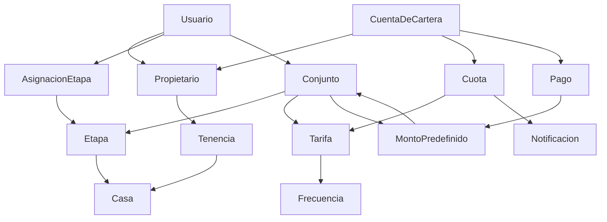

# Glosario — Lenguaje Ubicuo

> **Propósito:** Vocabulario compartido entre developers, product owners, y stakeholders. Cada término tiene una definición única y sin ambigüedad.

---

## A

### Admin
Usuario con permisos totales sobre un conjunto. Crea/configura: conjunto, etapas, casas, tarifas, usuarios, montos predefinidos. Genera reportes.

### Asignación de Etapa
Relación entre un `Usuario` (rol Cobrador) y una `Etapa`. Define qué etapas puede ver y operar cada cobrador.

---

## C

### Casa (Unidad)
Unidad habitacional dentro de una `Etapa`. Tiene una dirección interna (ej: "Casa 15", "Apartamento 301"). Pertenece a exactamente una `Etapa`.

### Cartera
Estado consolidado de todas las `Cuota`s de un `Propietario` (o de un conjunto completo). Incluye saldos: pagado, pendiente, vencido.

### Cobrador
Usuario que recorre las casas registrando pagos. Ve solo las `Etapa`s que le fueron asignadas. Opera **offline-first**.

### Conjunto
Entidad raíz del sistema. Representa un conjunto residencial (ej: "Portal del Prado - Etapa 3"). Agrupa `Etapa`s, `Propietario`s, `Tarifa`s, `Usuario`s y `MontoPredefinido`s.

### Cuota
Obligación de pago generada automáticamente para un `Propietario` según su `Frecuencia` y la `Tarifa` vigente. Tiene monto, período, fecha de vencimiento y estado.

### Cuenta de Cartera
Agregado raíz del BC Cartera. Agrupa las `Cuota`s y `Pago`s de un `Propietario`. Garantiza las invariantes financieras (saldo no negativo, FIFO, etc.).

---

## E

### Estado de Cuota
- `PENDIENTE`: cuota vigente, dentro del plazo.
- `PARCIAL`: cuota con pago parcial, aún tiene saldo.
- `PAGADA`: cuota totalmente cancelada.
- `VENCIDA`: cuota cuya fecha límite pasó sin pago completo.

### Etapa
Fase constructiva o sector dentro de un `Conjunto`. Ej: "Etapa 1 - Manzana A", "Sector Los Olivos". Agrupa `Casa`s.

---

## F

### Frecuencia
Periodicidad con la que se genera una `Cuota`. Valores: `SEMANAL`, `QUINCENAL`, `MENSUAL`.

---

## I

### Idempotencia
Propiedad que garantiza que registrar el mismo pago múltiples veces (por reintento de red) no lo duplica. Se implementa con `clientPaymentId` + unique constraint.

---

## M

### Monto Predefinido
Valor de pago configurado por el Admin (máximo 5 activos por conjunto). El `Cobrador` selecciona uno de estos valores al registrar un pago. No puede ingresar montos libres.

### Money (Value Object)
Representación inmutable de dinero. Se almacena en **centavos** (enteros) para evitar errores de punto flotante. Moneda: COP.

### Multi-tenant
Capacidad de servir a múltiples conjuntos desde una misma instancia. Implementado con columna `tenant_id` + RLS en PostgreSQL.

---

## N

### Notificación
Registro de un envío de correo electrónico a un `Propietario` cuando una `Cuota` vence. Tiene estado (`PENDIENTE`, `ENVIADA`, `FALLIDA`) y máximo 3 reintentos.

---

## P

### Pago
Transacción que cancela total o parcialmente una `Cuota`. Se registra offline-first (SQLite local → sync al backend). Siempre trazable a un `Cobrador` y una fecha.

### Propietario
Persona dueña de una o más `Casa`s. Puede tener varias `Tenencia`s activas (varias casas). Su información es privada — solo ve su propia cartera.

### Propietario (registro inline)
Flujo que permite al `Cobrador` crear un nuevo `Propietario` durante el proceso de cobro, para casos de recién mudados.

---

## S

### Sincronización
Proceso que envía los `Pago`s en cola local (`PENDIENTE_SYNC`) al backend cuando se detecta conexión a Internet. Usa `clientPaymentId` para idempotencia.

### SyncStatus
- `PENDIENTE_SYNC`: pago registrado localmente, aún no enviado al backend.
- `SYNC_OK`: pago confirmado por el backend.
- `CONFLICTO`: pago con `clientPaymentId` duplicado pero contenido distinto.

---

## T

### Tarifa
Monto configurado por el Admin para cada `Frecuencia`. Ej: Semanal=$10.000, Quincenal=$20.000, Mensual=$40.000. Las cuotas se generan con la tarifa vigente al momento de creación.

### Tenencia
Relación entre `Propietario` y `Casa` con fechas de inicio y fin. Permite que un propietario tenga múltiples casas (incluyendo ventas futuras).

### Trazabilidad
Capacidad de auditar cada `Pago`: quién lo registró (`Cobrador`), cuándo (fecha/hora registro), cuándo se sincronizó (fecha/hora sync).

---

## U

### Usuario
Credencial de acceso al sistema. Puede tener rol `ADMIN`, `COBRADOR`, o `PROPIETARIO`. Vinculado opcionalmente a un `Propietario` (para el rol Propietario).

---

## V

### Value Object (VO)
Objeto inmutable del dominio que se compara por valor (no por identidad). Ejemplos: `Money`, `Frecuencia`, `EstadoCuota`.

---

## Diagrama de relaciones entre términos

