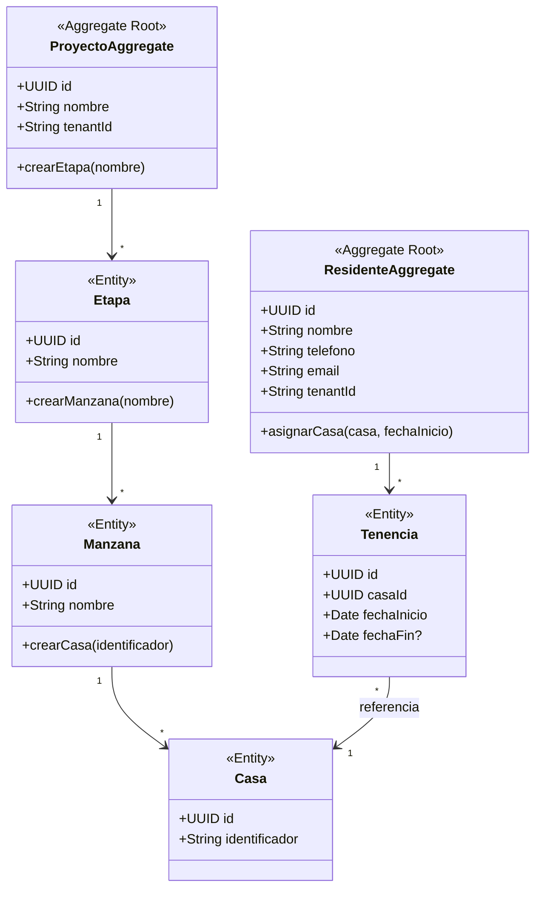
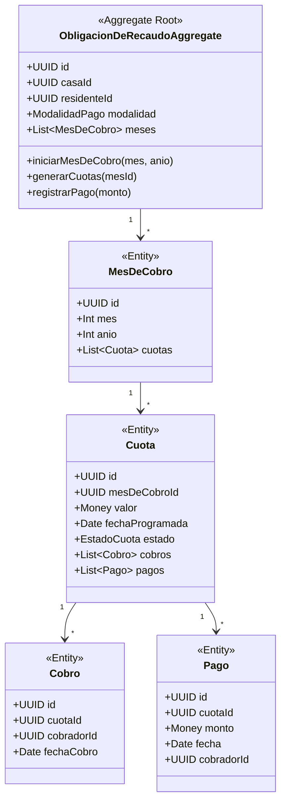

# 06 — Modelo de Dominio (Motor de Recaudo)

> **Propósito:** Descripción detallada de la arquitectura de dominio de Cívica Pago basada en el Motor de Recaudo.

---

## 6.1 BC Comunidad (Dominio Físico)

### Agregado: Proyecto

**Invariantes y Reglas:**
- La **Casa** es la pieza central. El sistema cobra la obligación asociada a una casa ocupada.
- Se debe seguir estrictamente la jerarquía: Proyecto → Etapa → Manzana → Casa.
- Un residente puede ser Propietario o Inquilino. Al asignar un residente a una casa, comienza el ciclo de recaudo.

---

## 6.2 BC Recaudo (Motor de Recaudo) — EL CORAZÓN DEL SISTEMA

### Agregado: ObligacionDeRecaudo

### Invariantes y Reglas del Motor de Recaudo

1. **Generación Automática:** Cada `Mes de Cobro` genera automáticamente sus cuotas según la `Modalidad de Pago` (Semanal=4, Quincenal=2, Mensual=1).
2. **Ciclo de Vida:**
   `Programada` → `Pendiente` (cuando llega la fecha) → `En Cobro` → `Pagada`
   *Variantes:* `Pago Parcial`, `Vencida`, `Solicitada`.
3. **Distribución Automática de Pagos (Waterfall):**
   - Si el pago es IGUAL al valor de la cuota: Cuota pasa a `Pagada`.
   - Si el pago es INFERIOR: Cuota pasa a `Pago Parcial`. Mantiene saldo pendiente.
   - Si el pago es SUPERIOR: Cierra la cuota actual y el excedente se abona automáticamente a la siguiente cuota programada.

---

## 6.3 BC Operaciones (Agenda y Solicitudes)

### Agenda del Cobrador
El cobrador trabaja estrictamente por **territorio**, nunca buscando residentes.
**Ruta:** Etapa → Manzana → Casa.
La agenda organiza automáticamente: Cobros pendientes, Cobros vencidos, Solicitudes de cobro.

### Solicitudes
Eventos generados por residentes o cobradores que requieren atención.
- Solicitud de Cobro
- Solicitud de Revisión

---

## 6.4 Arquitectura de Eventos (Actividad)

Todo evento de dominio alimenta el Historial, Actividad, Dashboards y Reportes.
Ejemplos de eventos:
- `CasaCreada`
- `ResidenteAsignado`
- `MesDeCobroIniciado`
- `CuotasGeneradas`
- `CuotaVencida`
- `CobroRegistrado`
- `PagoRegistrado`
- `PagoExcedenteDistribuido`
- `SolicitudCreada`

Estos eventos garantizan la trazabilidad total (Actividad).
