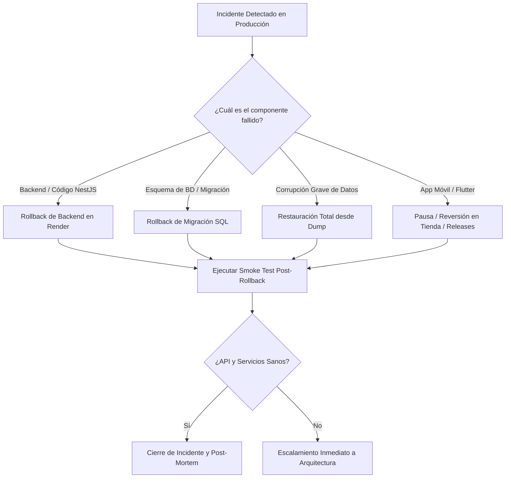

# Runbook de Rollback Rápido y Gestión de Incidentes — Cuentiva

Este documento establece el procedimiento operativo estándar (SOP) para revertir cambios defectuosos en producción (backend en Render, base de datos PostgreSQL en Neon/Supabase y aplicaciones móviles).

---

## 1. Criterios de Activación de Rollback (Severidad 1)

Se debe iniciar el procedimiento de reversión inmediata si se cumple **cualquiera** de las siguientes condiciones en los primeros 10 minutos tras un despliegue:

| Métrica | Umbral Crítico | Verificación |
|---|---|---|
| **Tasa de Errores HTTP (5xx)** | $> 5\%$ sostenido durante 3 min | Monitor de Render / `/api/metrics` |
| **Latencia p95 de API** | $> 1500\text{ ms}$ en endpoints principales | `/api/metrics` |
| **Disponibilidad de Autenticación** | Fallos masivos en `POST /auth/login` | Smoke test / Logs de NestJS |
| **Crash Loop al Arranque** | Fallo en arranque por fail-fast (`validateEnv`) | Logs de Render (`Starting Nest application...`) |
| **Integridad Transaccional** | Errores no controlados en `POST /pagos` o cobros | Logs de excepciones |

---

## 2. Flujo de Decisión de Rollback



---

## 3. Procedimiento Paso a Paso

### 3.1 Rollback de Backend (Render)

#### Opción A: Rollback Instantáneo desde la Consola de Render (Recomendado: < 60s)
1. Ingresar al dashboard de **Render** → Servicio Web de Cuentiva.
2. Navegar a la pestaña **Events**.
3. Localizar el despliegue anterior marcado como **"Live"** o exitoso.
4. Hacer clic en el menú contextual (`...`) a la derecha de ese despliegue y seleccionar **"Rollback to this deploy"**.
5. Esperar a que el estado cambie a **"Live"** (aproximadamente 30–60 segundos).

#### Opción B: Rollback mediante Git (Reversión Formal de Código)
Si se requiere revertir el historial del repositorio:
```bash
# 1. Asegurar rama actualizada
git checkout main && git pull origin main

# 2. Revertir el último commit de despliegue
git revert HEAD -m 1 --no-edit

# 3. Pushear para disparar el auto-deploy en Render
git push origin main
```

---

### 3.2 Rollback de Base de Datos (PostgreSQL)

#### Caso 1: Reversión de la última migración (`DOWN`)
Si el incidente se debe a un índice, constraint o alteración de tabla introducido en la última migración:
```bash
cd apps/backend

# 1. Consultar estado actual
npm run db:migrate:status

# 2. Revertir la última migración aplicada
npm run db:migrate:down

# 3. Confirmar que el estado volvió a [PENDIENTE]
npm run db:migrate:status
```

#### Caso 2: Restauración completa de emergencia desde Backup
Si hubo corrupción o pérdida de integridad de datos:
```bash
cd apps/backend

# 1. Validar el último backup disponible (dry-run)
node scripts/db-restore.mjs --dry-run

# 2. Ejecutar restauración con confirmación explícita
npm run db:restore -- --confirm

# 3. Verificar estado de la BD con el health check
curl -s https://cuentiva.onrender.com/api/health
```

---

### 3.3 Mitigación y Rollback en Clientes Móviles (Flutter)

1. **GitHub Releases / APKs Distribuidos**:
   - En caso de un APK con crash fatal en release, marcar la release en GitHub como "Pre-release" o despublicar el binario defectuoso.
   - Restablecer la versión previa como la "Latest Release".
2. **Google Play Store (Track de Producción / Prueba Abierta)**:
   - Ingresar a Google Play Console → **Producción** → **Versiones**.
   - Detener el lanzamiento gradual (Halt rollout) si estaba en porcentaje progresivo.
   - Promover la versión anterior mediante un nuevo bundle con incremento de `versionCode` si se requiere forzar la actualización hacia atrás.
3. **Compatibilidad con Versiones Previas de la API**:
   - La API mantiene compatibilidad aditiva hacia atrás en todos los endpoints de cobros, cartera y autenticación. Un rollback de frontend no requiere revertir contratos de backend si estos respetaron la política aditiva.

---

## 4. Verificación Post-Rollback (Validación de Humo)

Inmediatamente después de completar el rollback, ejecutar desde `apps/backend`:

```bash
SMOKE_BASE_URL=https://cuentiva.onrender.com/api \
SMOKE_USER=admin@civica.com \
SMOKE_PASS=tu_password \
npm run test:smoke
```

Criterio de éxito:
- `10/10 checks OK` (Health 200, Login exitoso, Dashboard administrador válido, Cobros paginados y ciclo completo de solicitudes).

---

## 5. Plantilla de Reporte Post-Mortem

Tras estabilizar la plataforma, documentar el incidente en un issue con la siguiente estructura:

```markdown
# Reporte de Incidente [INC-YYYYMMDD]

## Resumen Ejecutivo
- **Fecha y Hora de Inicio:** YYYY-MM-DD HH:MM UTC
- **Fecha y Hora de Resolución:** YYYY-MM-DD HH:MM UTC
- **Tiempo Total de Afectación (TTR):** XX minutos
- **Impacto:** % de usuarios afectados / operaciones fallidas

## Causa Raíz
- Explicación técnica precisa de la causa (ej. falta de variable de entorno, consulta lenta que agotó el pool de conexiones, etc.).

## Línea de Tiempo (Timeline)
- **HH:MM:** Despliegue de versión X.
- **HH:MM:** Primera alerta detectada por métricas / monitor.
- **HH:MM:** Decisión de rollback ejecutada vía Render / BD.
- **HH:MM:** Smoke test validado y servicio restablecido.

## Medidas Correctivas y Preventivas
1. [Acción 1]: Añadir prueba unitaria / E2E para evitar recurrencia.
2. [Acción 2]: Mejorar validación fail-fast o alertas automáticas.
```
